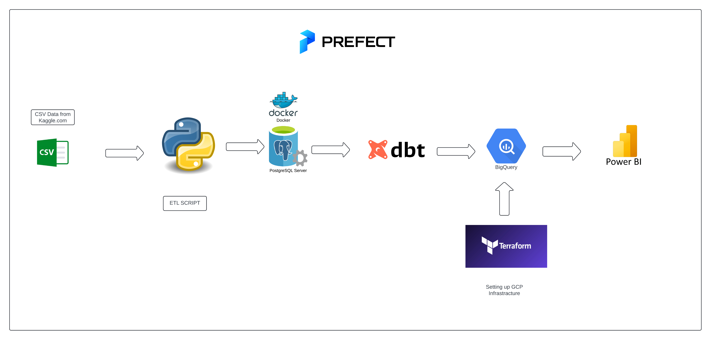

# Data Warehousing Project

This project involves setting up a data warehouse on Google Cloud Platform (GCP) using Terraform, pushing data to BigQuery with a Python script, and visualizing the data with Power BI. Data was acquired from kaggle.com

## Table of Contents

- [Project Overview](#project-overview)
- [Project Architecture](#project-architecture)
- [Power BI Dashboard](#power-bi-dashboard)
- [Prerequisites](#prerequisites)
- [Setup](#setup)
- [Testing](#testing)
- [License](#license)
- [Acknowledgments](#acknowledgments)
## Project Overview

The goal of this project is to do an etl pipeline with python, dbt and bigquery to analyze wine data.

## Project Architecture



## Power BI Dashboard


[Published report](https://app.powerbi.com/view?r=eyJrIjoiNTE1MmM2MTctZjFkYS00MGU1LWE2ZDgtNDViOGJjYzZiNTU1IiwidCI6IjFlMTdlYjI0LWE0N2YtNGFmMC1iNTA0LTA2MzljZDI4ZjYwNyIsImMiOjF9&pageName=8a4e701b408789514fdb)

## Prerequisites

Before you begin, ensure you have the following installed:

- [Terraform](https://www.terraform.io/downloads.html) (v1.0+)
- [Google Cloud SDK](https://cloud.google.com/sdk/docs/install)
- [Python](https://www.python.org/downloads/) (v3.8+)
- [Power BI Desktop](https://powerbi.microsoft.com/desktop/)

## Setup

### 1. Clone the Repository

First, clone the repository to your local machine:
```bash
git clone https://github.com/KarolG002/DWH_terraform_gcp.git
cd DWH-terraform-gcp
```

### 2. Set up terraform
```bash
cd terraform
```
Supply your own project id and key and then:
```bash
terraform init

terraform apply
```

#### To tear down infrastracture
```bash
terraform destroy
```

### 3. Install Python Dependencies
```bash
python -m venv venv
source venv/bin/activate  # On Windows use `venv\Scripts\activate`
pip install pandas pandas-gbq
pip install prefect

```
### 4. Set up prefect
```bash
prefect server start
```

### 5. Set up Docker
```bash
docker compose up
```

### 6. Run the extract and load to postgres data pipeline 
```bash
python src/pipeline/etl.py
```

### 7. Run dbt
```bash
dbt run
```

### 8. Run the load to bigquery data pipeline
```bash
python src/pipeline/bigquery_load.py
```
### 9. Set Up Power BI
Open Power BI Desktop.

Connect to your BigQuery dataset using the BigQuery Connector.

Create your visualizations based on the data available in the BigQuery tables.

## Testing
Navigate to the tests directory:

```bash
cd tests
```

Run the tests using pytest:
```bash
python -m pytest tests.py
```
## License
This project is licensed under the MIT License. See the LICENSE file for details.

## Acknowledgments

The dataset used in this project was acquired from [Kaggle.com](https://www.kaggle.com/datasets/budnyak/wine-rating-and-price)

Thanks to the open-source community for the tools and libraries used in this project.